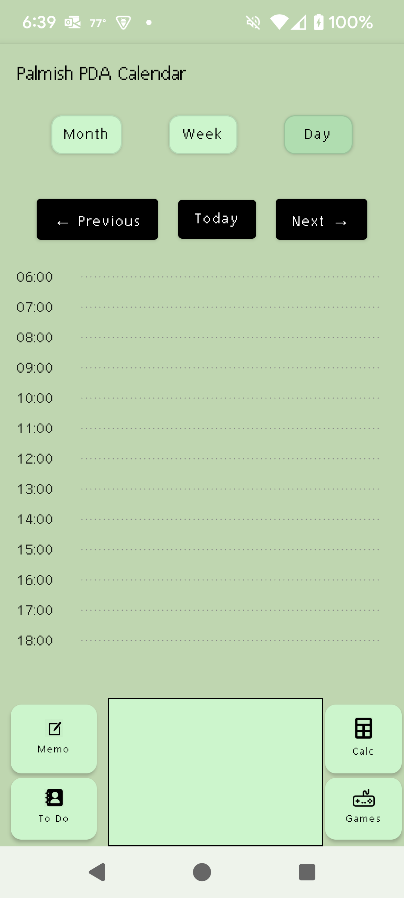

Palmish PDA Calendar

Palmish is a minimalist Android planner app inspired by the classic Palm OS. Designed for simplicity and focus, it brings back the feel of a personal digital assistant with modern capabilities.

👉 [Download Palmish v1.0.0 APK](https://github.com/drmeece/PalmishCalendar/releases/download/v1.0.0/Palmish-v1.0-release.apk)

You can sideload this APK onto your Android device. Be sure to enable “Install from unknown sources” in your phone settings.

📅 Calendar Features

Palmish includes a full-featured calendar with:

Day View – shows your daily schedule hour by hour

Week View – easy overview of the entire week

Month View – classic grid layout with dot markers for busy days

Event Details – tap any event to view pop-up details

Syncs with Google Calendar

Works with Outlook Calendar (if the official Outlook app is installed)

🗂️ PDA Tools

Palmish also includes essential PDA-style utilities:

📝 Memo Pad – quick notes with retro green screen style

✅ To-Do List – simple check-off interface with persistent tasks

🧮 Calculator – functional, no-frills math tool

📂 App Tray – Palm-style navigation bar with classic icons

🎮 Retro Games (Optional Distractions)

For nostalgia (and maybe a little procrastination), Palmish features a suite of retro mini-games:

🛸 Asteroids – arcade-style space shooter with scoring, UFOs, lives, and extras

🐍 Snake – classic grid snake game

🃏 Blackjack – simple card game

🧱 Tetris-style blocks – falling block puzzle mode

All games are entirely optional, launched from the “Games” button on the Palmish bottom bar.

🔧 How to Build and Run

Open the project in Android Studio

Connect a device or run the emulator

Build and run the app

From the main calendar screen, use the bottom bar to access Memo, To-Do, Calculator, or Games

🧑‍💻 About This Project

Palmish is a personal project created out of love for retro tech and simplicity. It combines calendar productivity with just enough fun to keep it human.

Created with patience, nostalgia, and Kotlin by D.R. and Zeke.🚀

📜 License

This project is open source and available under the MIT License. Feel free to use, modify, and share it (“Do whatever you want with this code—just include the original license and don’t blame me if something breaks.”)

